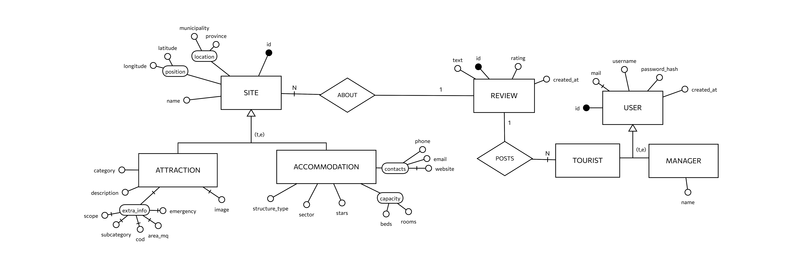

# Software Requirements & Architectural Specifications
## Multi-Database Tourism System: "Turismo Piemonte"

---

## 1. Executive Summary & System Overview
This document specifies the functional requirements, non-functional constraints, and architectural patterns for the "Turismo Piemonte" platform. The platform delivers a high-performance geospatial and exploratory experience for tourists looking for accommodations and attractions in the Piedmont region. Concurrently, it empowers enterprise managers with an analytical dashboard for regional resource capacity monitoring and telemetry tracking.

---

## 2. Polyglot Persistence Architecture
To guarantee maximum write/read isolation, horizontal scalability, and optimized query execution, the system rejects a monolithic database approach in favor of **Polyglot Persistence**. Each storage technology is selected based on its underlying mathematical model and data access patterns.

### 2.1 MongoDB: Single Source of Truth & Operational Store
* **Data Model:** Document-Oriented.
* **Architectural Rationale:** Acts as the foundational backbone and the Single Source of Truth (SSoT). The schema-less nature of document collections handles polymorphic entities gracefully. Most recent reviews are embedded directly within their respective documents to optimize common read pathways, for the remaining reviews, each document maintains an Extended Reference with `_id` and `rating` fields to perform statistics computation without a lookup operation.


#### Conceputal model:




#### Example documents:

Collection Users
```json
{
    "_id": { "$oid": "60c72b2f9b1d8b2bad123456" },
    "username": "mario_rossi",
    "email": "mario.rossi@example.com",
    "password_hash": "$2b$12$R9hZecE78S2Z2C02c3456e...",
    "role": "tourist",
    "created_at": { "$date": "2026-03-15T10:30:00Z" }
}
```

Collection Accommodations
```json
{
  "_id": {
    "$oid": "6a3b99594fca9987c5063abe"
  },
  "name": "Residenza Larice Alpina",
  "structure_type": "Locazioni Turistiche",
  "sector": "SETTORE EXTRALBERGHIERO",
  "stars": 2,
  "location": {
    "municipality": "Acqui Terme",
    "province": "AL"
  },
  "position": {
    "type": "Point",
    "coordinates": [
      8.470081174779834,
      44.66302191037583
    ]
  },
  "capacity": {
    "rooms": 4,
    "beds": 6
  },
  "contacts": {
    "phone": "0131 122522",
    "email": "residenzalaricealpina@gmail.com",
    "website": ""
  },
  "last_reviews": [
    {
      "username": "giuly92",
      "rating": 5,
      "text": "Struttura un po' datata ma gestione familiare calorosa.",
      "created_at": "2026-06-14T08:46:14.522032+00:00"
    },
    {
      "username": "traveler_luca",
      "rating": 4,
      "text": "Camera pulita e silenziosa, ideale per una sosta.",
      "created_at": "2026-03-29T08:46:14.521951+00:00"
    },
    {
      "username": "giuly92",
      "rating": 4,
      "text": "Struttura accogliente e ben tenuta, personale molto disponibile.",
      "created_at": "2026-02-04T08:46:14.521994+00:00"
    }
  ],
  "reviews": [
    {
      "_id": null,
      "rating": 5
    },
    {
      "_id": null,
      "rating": 4
    },
    {
      "_id": null,
      "rating": 4
    },
    {
      "_id": null,
      "rating": 5
    }
  ]
}
```

Collection Attractions
```json
{
  "_id": {
    "$oid": "6a3b9d006c304ab41d05a49a"
  },
  "category": "Siti UNESCO",
  "name": "Palazzina di caccia di Stupinigi",
  "description": "Una delle residenze sabaude più prestigiose del Piemonte. La costruzione dell'edificio, pensato per la caccia e le feste della famiglia reale, è stata avviata nel 1729 su progetto di Filippo Juvarra, uno degli architetti più rinomati del XVIII secolo.",
  "location": {
    "municipality": "Nichelino",
    "province": "TO"
  },
  "position": {
    "type": "Point",
    "coordinates": [
      7.605221687729391,
      44.995753792005296
    ]
  },
  "last_reviews": [
    {
      "username": "ale_piemonte",
      "rating": 4,
      "text": "Meno conosciuto di altri ma decisamente da scoprire.",
      "created_at": "2026-04-13T09:01:14.054879+00:00"
    },
    {
      "username": "silvia.b",
      "rating": 5,
      "text": "Paesaggio mozzafiato, consiglio di andarci al tramonto.",
      "created_at": "2026-02-16T09:01:14.054926+00:00"
    },
    {
      "username": "fra_explorer",
      "rating": 4,
      "text": "Meno conosciuto di altri ma decisamente da scoprire.",
      "created_at": "2026-01-23T09:01:14.054776+00:00"
    }
  ],
  "reviews": [
    {
      "_id": null,
      "rating": 4
    },
    {
      "_id": null,
      "rating": 5
    },
    {
      "_id": null,
      "rating": 4
    }
  ],
  "image": "palazzinadicacciadistupinigi.jpg"
}
```

Collection Reviews
```json
{
  "_id": {
    "$oid": "6a3b995a4fca9987c5063b68"
  },
  "username": "giuly92",
  "rating": 3,
  "text": "Servizio nella norma, niente di speciale ma nel complesso soddisfacente.",
  "created_at": "2026-01-16T08:46:14.511750+00:00",
  "site_id": "6a3b99594fca9987c5063abd",
  "collection": "accommodations"
}
```


### 2.2 Elasticsearch: Search Engine & Full-Text Analytics
* **Data Model:** Inverted Index oriented.
* **Architectural Rationale:** Offloads heavy string matching, multi-attribute filtering (e.g., by category, classification, or province), and complex text exploration away from the primary operational database. It features sub-millisecond search latencies, instant aggregations, and typographical error tolerance (fuzzy search).

#### Mappings:
Both indices use the Italian language analyzer for text fields and a custom `province_analyzer` that expands province abbreviations to their full names (e.g., `TO → Torino`, `CN → Cuneo`), enabling search by either form.

Mapping Accommodations
```json
{
  "mappings": {
    "properties": {
      "name":        { "type": "text",      "analyzer": "italian" },
      "reviews":     { "type": "text",      "analyzer": "italian" },
      "coordinates": { "type": "geo_point"                        },
      "location": {
        "properties": {
          "municipality": { "type": "text", "analyzer": "italian"          },
          "province":     { "type": "text", "analyzer": "province_analyzer" }
        }
      }
    }
  }
}
```

Mapping Attractions
```json
{
  "mappings": {
    "properties": {
      "name":        { "type": "text",      "analyzer": "italian" },
      "description": { "type": "text",      "analyzer": "italian" },
      "reviews":     { "type": "text",      "analyzer": "italian" },
      "coordinates": { "type": "geo_point"                        },
      "location": {
        "properties": {
          "municipality": { "type": "text", "analyzer": "italian"          },
          "province":     { "type": "text", "analyzer": "province_analyzer" }
        }
      }
    }
  }
}
```

### 2.3 Neo4j: Property Graph Database for Geospatial Proximity
* **Data Model:** Labelled Property Graph.
* **Architectural Rationale:** Specifically integrated to solve complex relational queries and proximity analysis without incurring the computational overhead of heavy relational JOINs or real-time trigonometric distance math. It maps locations as nodes and establishes `NEAR_TO` relationships with a `distance_km` property if they fall within a 3km radius. This enables rapid extraction of nearby points of interest (e.g., finding top attractions near a chosen accommodation).

#### Nodes and Edges structure:
Node Accommodation
```json
(:Accomodation{
    id: "acc_12345", 
    name: "Hotel Piemonte",
    location: "point({latitude: 45.0708, longitude: 7.6840})" 
})
```

Node Attraction
```json
(:Attraction{
    id: "att_67890",
    name: "Museo Egizio",
    location: "point({latitude: 45.0684, longitude: 7.6844})"
})

```


Relation Accomodation, Attraction
```json
(:Accomodation)-[:NEAR_TO {distance_km : 0.27}]-(:Attraction)

```

### 2.4 InfluxDB (Planned Specifications): Time-Series Storage
* **Data Model:** Time-Series.
* **Architectural Rationale:** Configured to ingest and analyze high-frequency, sequential telemetry. InfluxDB is assigned two critical scopes:
    1.  **Infrastructure Diagnostics:** Continuous monitoring of system-wide container health (CPU utilization, memory consumption, network saturation across the polyglot cluster nodes).
    2.  **Business Events:** Storing event data over time (e.g., real-time user registration trends, review posting frequency) to populate historical trend graphs on the manager’s dashboard.


#### Measurements structure:

Diagnostic Measurement
```lineprotocol
measurement,tag_set field_set timestamp
container_metrics,container_name=processor_elk,host=docker_cluster cpu_usage_percent=14.5,memory_usage_mb=182.4 1782060000000000000
container_metrics,container_name=processor_neo4j,host=docker_cluster cpu_usage_percent=22.1,memory_usage_mb=210.8 1782060000000000000
container_metrics,container_name=mongodb,host=docker_cluster cpu_usage_percent=5.2,memory_usage_mb=512.0 1782060000000000000
```

Events Measurement
```lineprotocol
business_telemetry,event_type=user_registration,role=tourist count=1i 1782060120000000000
business_telemetry,event_type=review_created,target_collection=accommodations count=1i 1782060155000000000
business_telemetry,event_type=search_executed,index=attractions response_time_ms=12i 1782060180000000000
```

---


### 2.5 Messaging Infrastructure (Kafka Topics & Semantics)
To decouple the primary store from the specialized read models, Apache Kafka acts as the log-centric ingestion backbone. Debezium pipes changes into specific topics following the naming convention `<ServerName>.<DatabaseName>.<CollectionName>`.

* **`Tourism.Tourism.accommodations`**: Captures mutations from the accommodations collection.
* **`Tourism.Tourism.attractions`**: Captures mutations from the attractions collection.

#### Message Lifecycle & Tombstones
Every message delivered contains an explicit operation flag (`"op"`):
* `"op": "c"` / `"r"` (Create / Read-Snapshot): Propagates the full document under the `"after"` block.
* `"op": "u"` (Update): Supplies partial or complete post-mutation states to incremental indexing loops.
* `"op": "d"` (Delete): Emits the removed document context followed immediately by a **Tombstone Message** (a record with an identical primary key but a completely `null` value payload). Secondary consumers intercept these null payloads to trigger structural cleanups, preventing data leakage and orphaning inside Elasticsearch and Neo4j.

## 3. Change Data Capture (CDC) & Event-Driven Pipeline
Data synchronization across the secondary databases (Elasticsearch and Neo4j) is achieved asynchronously via an **Event-Driven Architecture**.